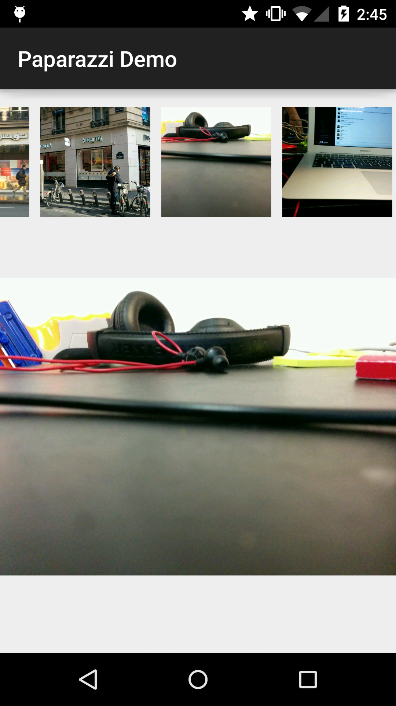

# Paparazzi [](https://travis-ci.org/Sidereo/Paparazzi)

Do you need to include a picture picker in your activity?

Like a horizontal list of recent pictures and the possibility to open the camera/gallery?



###**BOOM! That's what paparazzi does.**
(the top part is Paparazzi, the bottom part is just an imageview)


## Usage

```xml

  <com.sidereo.paparazzi.view.Paparazzi
    paparazzi:paparazzi__pictureNumber="40"
    android:id="@+id/paparazzi"
    android:clipToPadding="false"
    android:layout_width="match_parent"
    android:layout_height="100dp"/>


```
Of course, you can customize `paparazzi:paparazzi__pictureNumber` value to fit your needs ;)

When you're done, get the View into a variable and then:

```java
paparazzi.prepare(this).disableCamera().disableGallery().shoot();

```

`this` here is an `Activity` implementing `Redaction`

`disableCamera()` & `disableGallery()` are obviously optional, in case you don't want to open the camera or the gallery.


## Dependency

**Gradle**
```groovy
compile 'com.sidereo:paparazzi:1.0.0'
```
**Maven**

```
Who uses that? Seriously.
```


## License

Paparazzi is licensed under the Apache 2 license (you can use it in commercial and open source projects).

```
Copyright 2015 Sidereo

Licensed under the Apache License, Version 2.0 (the "License");
you may not use this file except in compliance with the License.
You may obtain a copy of the License at

    http://www.apache.org/licenses/LICENSE-2.0

Unless required by applicable law or agreed to in writing, software
distributed under the License is distributed on an "AS IS" BASIS,
WITHOUT WARRANTIES OR CONDITIONS OF ANY KIND, either express or implied.
See the License for the specific language governing permissions and
limitations under the License.
```
